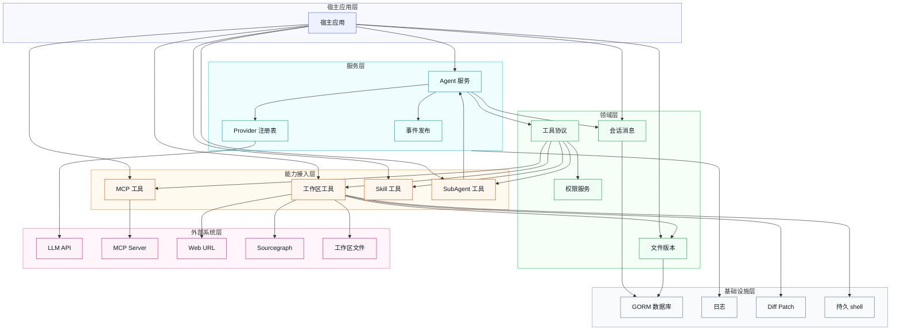
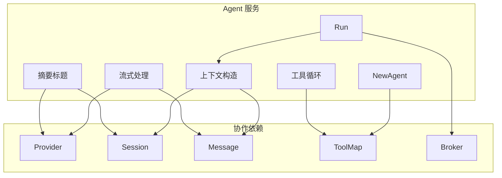
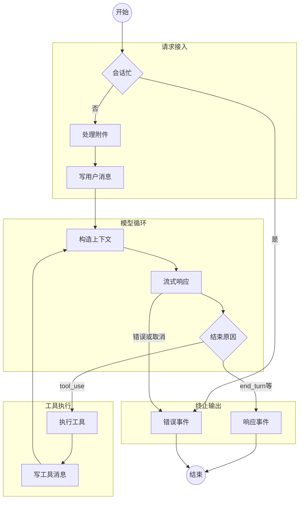
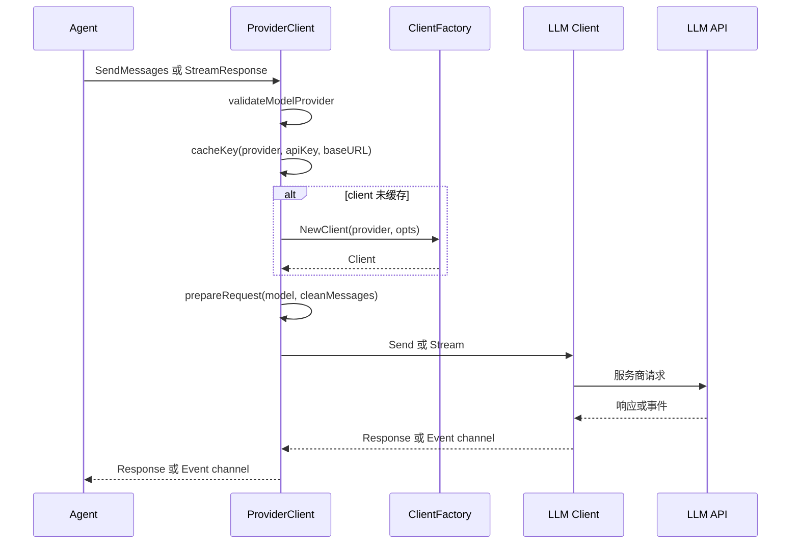
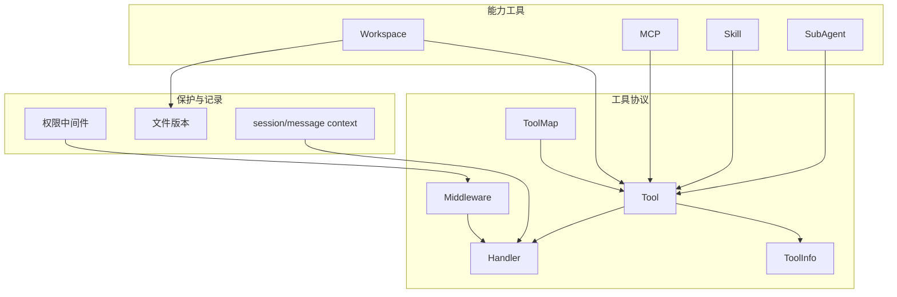
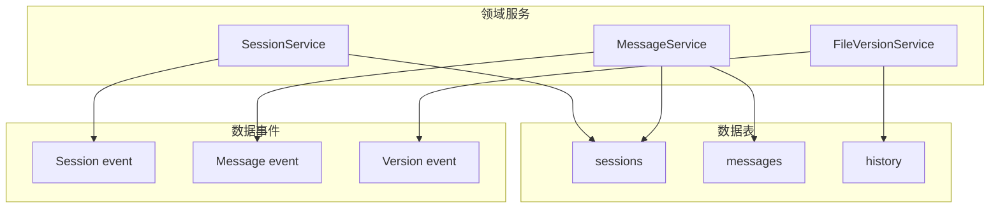
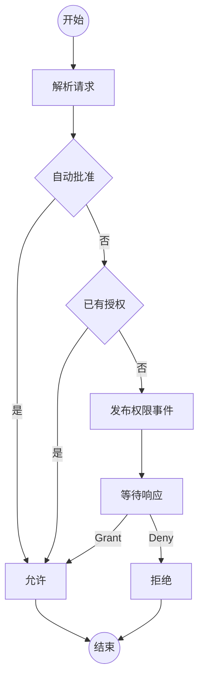
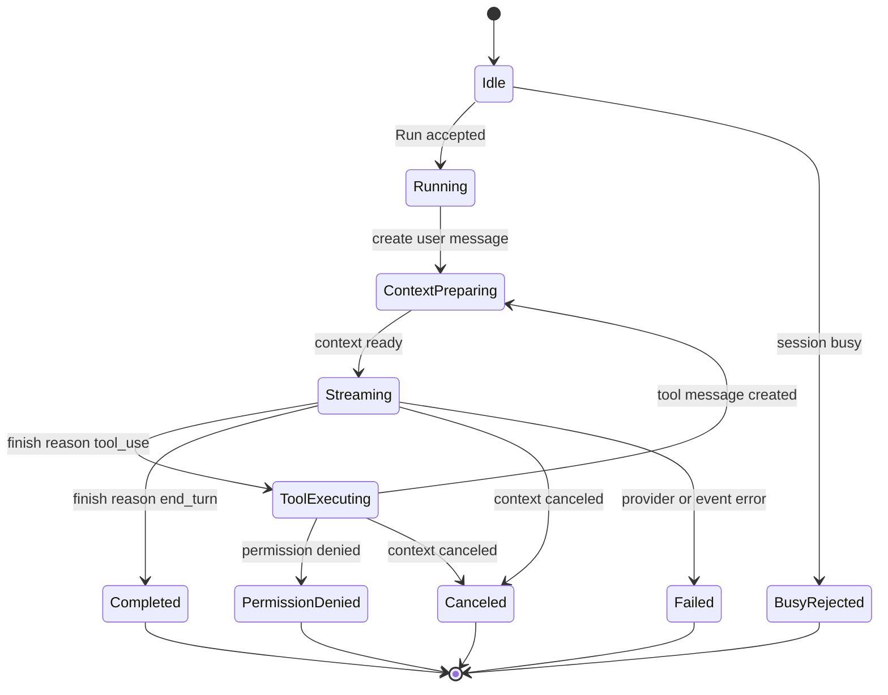
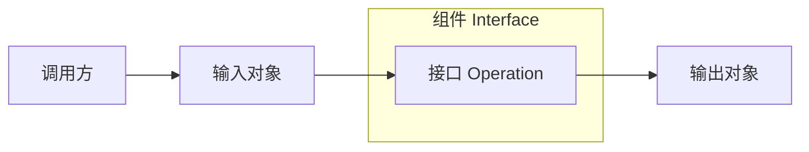

# Agent SDK 设计

## 1. 架构

### 1.1 系统边界

| 项目 | 说明 |
| --- | --- |
| 范围 | Go Agent SDK，提供 Agent 运行编排、LLM provider/client 适配、会话与消息持久化、工具协议、权限请求、工作区工具、MCP 工具、Skill 工具、SubAgent 工具、文件版本记录、日志与 diff/patch 基础能力。 |
| 入口 | 宿主应用通过 `pkg/agent.NewAgent` 创建 Agent 服务；通过 `pkg/data/db.NewClient`、`pkg/memory/session.NewSessionService`、`pkg/memory/message.NewService`、`pkg/version.NewFileVersionService` 装配持久化服务；通过 capability 包创建工具并传入 Agent。 |
| 外部依赖 | LLM 服务商 API、MCP server、Sourcegraph API、HTTP/HTTPS URL、宿主提供的文件系统工作区、SQLite/MySQL 数据库。 |
| 非范围 | 当前仓库不包含 CLI/TUI、IDE/LSP、Skill 文件发现系统、prompt resolver、repo/history 独立仓储层和宿主配置中心；README 中提到但当前文件树不存在的 `pkg/config`、`pkg/prompt`、`pkg/data/repo`、`pkg/memory/history` 不作为本设计事实。 |

### 1.2 架构图

箭头表示运行时调用、数据依赖或能力装配方向；细粒度内部流程在 `2. 单元` 中展开。

| 单元 | 职责 | 直接依赖 |
| --- | --- | --- |
| Agent 服务 | 接收用户输入，维护活跃请求，构造模型上下文，流式接收模型事件，落库消息，执行工具循环，汇总 token 与成本，发布运行事件。 | Provider 注册表、会话服务、消息服务、工具协议、PubSub、Logging。 |
| Provider 注册表 | 校验 `ModelProvider`，按 provider/API key/base URL 缓存 LLM client，发送同步请求或流式请求。 | LLM client factory、各服务商 SDK。 |
| 工具协议 | 定义工具元信息、调用参数、响应结构、工具分类、middleware 链和按 kind/name 的 ToolMap。 | Permission middleware、能力工具实现。 |
| 能力接入 | 将工作区、MCP、Skill、SubAgent 能力包装为统一 `toolcore.Tool`。 | 工具协议、权限服务、文件版本服务、外部系统。 |
| 会话消息 | 持久化 `sessions` 与 `messages`，提供列表、创建、更新、删除，并发布数据变更事件。 | GORM 数据库、PubSub。 |
| 文件版本 | 持久化工作区文件历史版本，支撑写入、编辑、patch 后的变更记录。 | GORM 数据库、PubSub。 |
| 权限服务 | 对工具执行请求进行阻塞式授权、临时授权、持久授权和 session 自动批准。 | PubSub、工具权限 resolver。 |
| 基础设施 | 提供数据库连接、日志、shell、diff/patch、文件读写状态等支撑能力。 | SQLite/MySQL、操作系统、第三方库。 |

## 2. 单元

### 2.1 Agent 服务组件关系

| 组件 | 职责 | 协作对象 |
| --- | --- | --- |
| `NewAgent` | 校验 memory 必须同时包含 session/message，默认创建 provider，构建 `ToolMap`，初始化事件 broker 和活跃请求表。 | `AgentConfig`、`provider.NewProvider`、`toolcore.BuildToolMap`。 |
| `Run` | 按 session 粒度防重入，创建可取消 context，异步执行生成流程，完成后发布 `AgentEvent`。 | `activeRequests`、`processGeneration`、`pubsub.Broker`。 |
| 上下文构造 | 首轮异步生成标题，创建 user message；若 session 有 summary，则使用 summary 加后续 conversation 作为模型上下文。 | `session.Service`、`message.Service`。 |
| 流式处理 | 创建 assistant message，消费 `client.Event`，追加 reasoning/content/tool call/finish，记录 usage。 | `ProviderClient.StreamResponse`、`message.MessageRecord`。 |
| 工具循环 | 当 assistant finish reason 为 `tool_use` 时执行工具并创建 tool message，再把 assistant/tool message 追加进上下文继续请求模型。 | `RunTool`、`message.ToolResult`。 |
| 摘要标题 | 标题用于首条用户消息的会话 title；摘要用于写入 `summary` 消息并更新 `SummaryMessageID`。 | `sendMessages`、`session.Save`、`message.Create`。 |

### 2.2 Agent 运行流程

流程说明：

| 步骤 | 执行者 | 动作 | 输出 |
| --- | --- | --- | --- |
| 1 | `Run` | 检查 `activeRequests`，同一 session 正在运行时直接返回 `ErrSessionBusy`。 | 可运行 context 或错误。 |
| 2 | `Run` | 按模型能力过滤附件，将附件转为 `BinaryContent`。 | 用户输入 parts。 |
| 3 | `processGeneration` | 读取历史消息；首轮消息为空时异步生成标题。 | 历史状态与标题任务。 |
| 4 | `createUserMessage` | 创建 user conversation message，非 assistant 消息自动添加 `Finish{Reason:"stop"}`。 | 持久化 user message。 |
| 5 | `buildModelContext` | 无 summary 时读取会话 conversation；有 summary 时读取 summary 加 summary 之后的 conversation。 | 模型上下文消息列表。 |
| 6 | `streamAndHandleEvents` | 创建空 assistant message，向 provider 发起 stream，逐个事件更新 message parts。 | assistant message。 |
| 7 | `processEvent` | 对 content/reasoning/tool/complete/error 事件分别追加内容、工具调用、finish reason、usage 或错误。 | 更新后的 assistant message 与 session usage。 |
| 8 | `runToolCalls` | 运行 assistant 中的 tool calls；权限拒绝时写入错误结果并将剩余工具标记取消。 | tool results。 |
| 9 | `processGeneration` | 如果 finish reason 为 `tool_use` 且有工具结果，则写 tool message 并进入下一轮模型请求。 | 继续循环或最终 `AgentEventResponse`。 |

### 2.3 LLM Provider 与 Client 适配

| 组件 | 职责 | 实现语义 |
| --- | --- | --- |
| `ModelProvider` | 描述本次请求使用的 provider、API key、base URL 和 model。 | provider 与 model ID 不能为空；model 会写入 `client.Request.Model`。 |
| `ProviderClient` | provider client 注册表。 | 使用 provider/API key/base URL 的 SHA-256 hash 作为缓存 key，不把 model 放进缓存 key。 |
| `client.Request` | 跨服务商统一请求结构。 | 包含 system message、debug、message records、tool infos 和 model。 |
| `client.Event` | 跨服务商统一流式事件。 | Agent 只依赖标准事件类型，不直接处理服务商原生事件。 |
| Client factory | 将 provider 枚举映射到具体 SDK adapter。 | OpenAI 兼容 provider 复用 openai client 并注入默认 base URL。 |

### 2.4 工具协议与能力装配

| 能力 | 工具或入口 | 关键行为 |
| --- | --- | --- |
| 工作区工具 | `bash`、`edit`、`fetch`、`glob`、`grep`、`ls`、`patch`、`sourcegraph`、`view`、`write` | 每个工具通过 `Workspace.Resolve` 约束路径在 root 内；写入类工具可记录 diff、变更 metadata 和文件版本。 |
| MCP 工具 | `NewMcpTool` | 初始化 MCP client，发现远端 tools，并包装为 `mcpName_toolName` 的 `ToolKindMCP` 工具；调用时重新连接 server 并执行 `CallTool`。 |
| Skill 工具 | `NewSkillTool` | 将宿主提供的 `LoadContent` 包装为无参工具；metadata 拼接进描述；可注入 root path 内容。 |
| SubAgent 工具 | `NewAgentTool` | 创建 task session，以当前 tool call ID 作为子会话 ID，运行新的 Agent，并把子会话成本累加到父会话。 |
| 权限中间件 | `PermissionMiddleware`、workspace `Permission` | 对 bash/fetch/write/edit/patch 生成权限请求；安全只读命令可跳过授权；拒绝时返回 `permission_denied` 路径。 |

### 2.5 记忆与持久化单元

| 服务 | 职责 | 持久化语义 |
| --- | --- | --- |
| `session.Service` | 创建普通会话、标题会话、任务会话，读取、保存、删除和列出顶层会话。 | `List` 只返回 `parent_session_id = ""` 的顶层会话；`Save` 只更新 title、token、summary、cost。 |
| `message.Service` | 创建、更新、读取、查询、删除消息，并维护 session message_count。 | 创建消息时事务写入 message 并递增 session count；删除消息时事务删除并递减 count。 |
| `version.FileVersionService` | 记录同一 session/path 的文件内容版本。 | 表名为 `history`；首版是 initial version，后续版本按 `v1`、`v2` 递增。 |
| `db.DbClient` | 创建 SQLite/MySQL GORM 连接并执行 auto migrate。 | 默认 SQLite DSN 为 `.ferryer/agent.db`；MySQL 支持 DSN 或字段拼接。 |

### 2.6 权限与事件状态

流程说明：

| 步骤 | 执行者 | 动作 | 输出 |
| --- | --- | --- | --- |
| 1 | Tool middleware | Resolver 根据 tool name 和 input 生成一个或多个 `PermissionRequest`。 | 权限请求列表。 |
| 2 | `permission.Service` | 若 session 已自动批准，直接返回 true。 | 允许执行。 |
| 3 | `permission.Service` | 匹配同 session、tool、action、resource URI 的持久授权。 | 允许执行或进入等待。 |
| 4 | `permission.Service` | 发布 `CreatedEvent`，把响应 channel 放入 pending map，阻塞等待 grant/deny。 | 授权结果。 |
| 5 | Tool middleware | 被拒绝时返回 `ErrorPermissionDenied`；Agent 将当前工具结果标记 permission denied，并取消后续工具。 | 工具错误结果与 finish reason。 |

### 2.7 Agent 请求状态机

| 状态 | 含义 | 可进入条件 | 可退出条件 |
| --- | --- | --- | --- |
| Idle | session 没有活跃 Agent 请求。 | `activeRequests` 中不存在该 session ID。 | `Run` 被接受或因忙碌被拒绝。 |
| BusyRejected | 同一 session 已存在活跃请求。 | `IsSessionBusy(sessionID)` 为 true。 | 返回 `ErrSessionBusy` 后终止。 |
| Running | 请求已登记 cancel func，goroutine 开始执行。 | `activeRequests.Store(sessionID, cancel)` 完成。 | 创建 user message 并进入上下文准备。 |
| ContextPreparing | 正在读取 session/message 并构造模型上下文。 | 用户消息已创建，或上一轮工具消息已创建。 | 上下文构造成功进入 streaming；失败进入 failed。 |
| Streaming | 已向 provider 发起流式请求并更新 assistant message。 | `streamResponse` 返回事件 channel。 | complete、tool use、cancel 或 error。 |
| ToolExecuting | assistant message 中存在工具调用并开始执行。 | finish reason 为 `tool_use` 且 tool calls 非空。 | 写入 tool message 后回到上下文准备；权限拒绝或取消则终止。 |
| Completed | 模型本轮没有继续工具调用，返回最终响应。 | finish reason 不是 `tool_use`，或没有工具结果需要继续。 | 发布最终 response event 后终止。 |
| PermissionDenied | 工具权限被拒绝。 | 工具 middleware 返回 `permission.ErrorPermissionDenied`。 | assistant finish reason 写为 `permission_denied` 后终止。 |
| Canceled | 请求 context 被取消。 | `Cancel(sessionID)` 或上游 context 取消。 | assistant finish reason 写为 `canceled` 后终止。 |
| Failed | 消息、provider、事件处理、工具执行出现不可继续错误。 | 任一关键步骤返回错误。 | 发布 error event 后终止。 |

## 3. 单元详情

接口契约可用 SysML Interface Block 语义表达：组件是接口块，接口是 Operation，输入和输出是 Flow Property，箭头表示 Item Flow。各组件下的接口表继续承接精确输入、输出和调用语义。

### 3.1 `agent.Service`

#### 3.1.1 功能职责

| 项目 | 说明 |
| --- | --- |
| 功能定位 | Agent 运行编排组件，负责把一次用户请求组织成消息持久化、模型流式调用、工具执行循环、取消处理、摘要与事件发布的完整生命周期。 |
| 职责 | 创建 Agent 实例；按 session 防重入；运行模型与工具循环；执行工具调用；取消普通请求和摘要请求；生成标题；生成摘要；跟踪 usage 与 cost；发布 Agent 事件。 |

#### 3.1.2 接口契约

| 接口 | 输入 | 输出 | 语义 |
| --- | --- | --- | --- |
| `NewAgent` | `AgentOption...` | `Service`、`error` | 创建 Agent 服务；memory session/message 必须同时配置；未配置 provider 时创建默认 provider；工具集合会构建为 `ToolMap`。 |
| `Run` | `context`、`ModelProvider`、`sessionID`、用户文本、附件 | `AgentEvent` channel、`error` | 启动一次会话请求；同一 session 已忙时返回 `ErrSessionBusy`；成功时异步发布并返回最终事件。 |
| `RunTool` | `context`、`sessionID`、`ToolCall` | `ToolResponse`、`error` | 按工具名在所有 kind 中查找并执行；同名多个工具返回 `ErrToolAmbiguous`。 |
| `RunToolByKind` | `context`、`sessionID`、`ToolKind`、`ToolCall` | `ToolResponse`、`error` | 按 kind/name 精确执行工具。 |
| `Cancel` | `sessionID` | 无 | 取消普通请求和 `sessionID+"-summarize"` 摘要请求。 |
| `Summarize` | `context`、`ModelProvider`、`sessionID` | `error` | 异步生成 summary message，更新 session 的 summary 引用、token 和 cost，并通过事件发布进度。 |
| `MapTools` | 无 | `ToolMap` | 返回当前工具映射的浅拷贝，避免调用方直接替换内部 map。 |
| `IsSessionBusy` / `IsBusy` | session ID 或无 | `bool` | 查询 session 或全局是否存在活跃请求。 |

#### 3.1.3 实体模型

| 实体 | 类型 | 组件内语义 |
| --- | --- | --- |
| `AgentEvent` | 事件对象 | Agent 对外发布 response、summarize、error 结果，包含 message、error、session ID、progress 和 done。 |
| `AgentConfig` | 配置对象 | Agent 构造输入，包含名称、描述、memory、provider、tools、debug 和 auto compact 配置。 |
| `MemoryConfig` | 配置对象 | 将 session service 与 message service 作为一组注入 Agent。 |

##### `AgentEvent`

| 字段 | 类型 | 含义 | 关键语义 |
| --- | --- | --- | --- |
| `Type` | `AgentEventType` | 事件类型。 | 可选 `error`、`response`、`summarize`。 |
| `Message` | `MessageRecord` | Agent 生成或关联的消息。 | response 事件中承载最终 assistant message。 |
| `Error` | `error` | 运行错误。 | error 事件中承载失败原因。 |
| `SessionID` | `string` | 关联 session。 | summarize 完成事件会返回 session ID。 |
| `Progress` | `string` | 摘要进度文本。 | summarize 事件使用。 |
| `Done` | `bool` | 是否终止。 | response、error、summary complete 会置为 true。 |

### 3.2 `session.Service`

#### 3.2.1 功能职责

| 项目 | 说明 |
| --- | --- |
| 功能定位 | 会话边界组件，用于承载 Agent 对话归属、父子会话关系、标题、消息计数、摘要锚点、token 统计和成本累计。 |
| 职责 | 创建顶层会话、标题生成会话和任务子会话；读取、保存、删除 session；列出顶层 session；在创建、更新、删除时发布 session 事件。 |

#### 3.2.2 接口契约

| 接口 | 输入 | 输出 | 语义 |
| --- | --- | --- | --- |
| `NewSessionService` | `Option...` | `Service` | 创建会话服务并执行 `SessionRecord` auto migrate；缺少 DB client 时 panic。 |
| `Create` | `context`、`title` | `SessionRecord`、`error` | 创建普通顶层 session，ID 使用 UUID。 |
| `CreateTitleSession` | `context`、`parentSessionID` | `SessionRecord`、`error` | 创建标题生成子会话，ID 为 `title-` 加父 session ID。 |
| `CreateTaskSession` | `context`、`toolCallID`、`parentSessionID`、`title` | `SessionRecord`、`error` | 创建 SubAgent 任务子会话，ID 使用 tool call ID。 |
| `Get` | `context`、`id` | `SessionRecord`、`error` | 按 ID 获取 session；不存在返回 `ErrNotFound`。 |
| `List` | `context` | `[]SessionRecord`、`error` | 只列出 `parent_session_id = ""` 的顶层 session，按创建时间倒序。 |
| `Save` | `context`、`SessionRecord` | `SessionRecord`、`error` | 更新 title、prompt tokens、completion tokens、summary message ID 和 cost。 |
| `Delete` | `context`、`id` | `error` | 删除 session 记录并发布删除事件。 |

#### 3.2.3 实体模型

##### `SessionRecord`

| 字段 | 类型 | 含义 | 关键语义 |
| --- | --- | --- | --- |
| `ID` | `string` | 会话主键。 | 普通会话使用 UUID；task session 使用 tool call ID；title session 使用 `title-` 加父会话 ID。 |
| `ParentSessionID` | `string` | 父会话 ID。 | 顶层会话为空；`List` 只返回顶层会话。 |
| `Title` | `string` | 会话标题。 | 首轮用户输入可触发异步标题生成并保存。 |
| `MessageCount` | `int64` | 消息数量。 | 由 `message.Service` 在 create/delete 事务中维护。 |
| `PromptTokens` | `int64` | 最近请求输入 token。 | Agent usage 跟踪时更新；summary 成功后置 0。 |
| `CompletionTokens` | `int64` | 最近请求输出 token 或 cache read token 合计。 | Agent usage 跟踪时更新。 |
| `SummaryMessageID` | `string` | 当前摘要消息 ID。 | 非空时模型上下文由 summary 加后续 conversation 构成。 |
| `Cost` | `float64` | 会话累计成本。 | 按 model 成本字段和 usage 计算后累加；SubAgent 成本回滚累加到父会话。 |
| `CreatedAt` / `UpdatedAt` | `int64` | GORM 时间戳。 | 使用 auto create/update time。 |

实体关系：

| 来源字段 | 指向字段 | 关系 | 语义 |
| --- | --- | --- | --- |
| `sessions.parent_session_id` | `sessions.id` | 自关联 | task session、title session 可指向父 session。 |
| `sessions.summary_message_id` | `messages.id` | 引用 | 指向当前用于压缩上下文的 summary message。 |

### 3.3 `message.Service`

#### 3.3.1 功能职责

| 项目 | 说明 |
| --- | --- |
| 功能定位 | 消息持久化组件，用于保存 conversation 与 summary 消息，以及 text、reasoning、binary、tool call、tool result、finish 等多态内容片段。 |
| 职责 | 创建、更新、读取、查询、删除消息；按 session 和 kind 列出上下文消息；维护 session 的 message count；序列化和反序列化 `ContentParts`。 |

#### 3.3.2 接口契约

| 接口 | 输入 | 输出 | 语义 |
| --- | --- | --- | --- |
| `NewService` | `Option...` | `Service` | 创建消息服务并执行 `MessageRecord` auto migrate；缺少 DB client 时 panic。 |
| `Create` | `context`、`sessionID`、`CreateMessageParams` | `MessageRecord`、`error` | 事务创建消息并递增 session message count；kind 为空时归一化为 conversation；非 assistant 自动添加 finish part。 |
| `Update` | `context`、`MessageRecord` | `error` | 保存消息 parts，并根据 finish part 同步 `finished_at`。 |
| `Get` | `context`、`id` | `MessageRecord`、`error` | 按 ID 获取消息；不存在返回 `ErrNotFound`。 |
| `List` | `context`、`sessionID`、可选 `ListCondition` | `[]MessageRecord`、`error` | 默认列出 conversation；可按 kind 和 after message 过滤，按创建时间正序。 |
| `Delete` | `context`、`id` | `error` | 事务删除消息并递减 session message count。 |
| `DeleteSessionMessages` | `context`、`sessionID` | `error` | 删除当前 session 的 conversation 与 summary 消息。 |

#### 3.3.3 实体模型

##### `MessageRecord`

| 字段 | 类型 | 含义 | 关键语义 |
| --- | --- | --- | --- |
| `ID` | `string` | 消息主键。 | 创建时使用 UUID。 |
| `Kind` | `MessageKind` | 消息用途。 | 空 kind 会归一化为 `conversation`；支持 `conversation` 和 `summary`。 |
| `Role` | `MessageRole` | 消息角色。 | 支持 `assistant`、`user`、`system`、`tool`。 |
| `SessionID` | `string` | 所属会话。 | 查询、创建、删除均按 session 约束。 |
| `Parts` | `ContentParts` | 消息内容片段 JSON。 | 自定义 `Value/Scan` 包装 part type 和 data，保证反序列化为具体 part。 |
| `Model` | `string` | 生成该消息的模型 ID。 | assistant 与 summary 消息写入模型 ID。 |
| `FinishedAt` | `int64` | 结束时间。 | `Update` 根据 `Finish` part 写入。 |
| `CreatedAt` / `UpdatedAt` | `int64` | GORM 时间戳。 | `UpdatedAt` 同时用于节流类逻辑的时间参考。 |

##### `ContentPart`

| 类型 | 字段 | 含义 | 关键语义 |
| --- | --- | --- | --- |
| `TextContent` | `Text` | 文本内容。 | assistant content delta 会追加到该 part。 |
| `ReasoningContent` | `Thinking` | 推理内容。 | thinking delta 会追加到该 part。 |
| `ImageURLContent` | `URL`、`Detail` | 图片 URL 内容。 | 用于支持图片 URL 的模型输入。 |
| `BinaryContent` | `Path`、`MIMEType`、`Data` | 二进制附件。 | OpenAI provider 下转为 data URL，其余 provider 使用 base64。 |
| `ToolCall` | `ID`、`Name`、`Input`、`Type`、`Finished` | 模型请求工具调用。 | tool use start/stop 会添加或完成该 part。 |
| `ToolResult` | `ToolCallID`、`Name`、`Content`、`Metadata`、`IsError` | 工具执行结果。 | Agent 创建 tool role message 时写入。 |
| `Finish` | `Reason`、`Time` | 消息终止原因。 | `AddFinish` 会移除旧 finish 后追加新 finish。 |

实体关系：

| 来源字段 | 指向字段 | 关系 | 语义 |
| --- | --- | --- | --- |
| `messages.session_id` | `sessions.id` | 多对一 | 一个 session 拥有多条 conversation 或 summary message。 |

### 3.4 `provider.ProviderClient`

#### 3.4.1 功能职责

| 项目 | 说明 |
| --- | --- |
| 功能定位 | 模型访问注册组件，用于把 Agent 的统一模型请求路由到具体 provider client，并复用同 provider/API key/base URL 的 client 实例。 |
| 职责 | 校验 model provider；按缓存 key 获取或创建 provider client；清理空消息；注入模型元数据；发送同步请求或流式请求。 |

#### 3.4.2 接口契约

| 接口 | 输入 | 输出 | 语义 |
| --- | --- | --- | --- |
| `NewProvider` | 无 | `*ProviderClient` | 创建空 provider client 注册表。 |
| `SendMessages` | `context`、`ModelProvider`、`client.Request` | `client.Response`、`error` | 获取 client，准备请求并执行非流式发送。 |
| `StreamResponse` | `context`、`ModelProvider`、`client.Request` | `client.Event` channel | 获取 client，准备请求并返回流式事件；client 创建失败时返回只包含 error event 的 channel。 |
| `Client` | `context`、`ModelProvider` | `client.Client`、`error` | 校验 provider 与 model ID，按 provider/API key/base URL 缓存或创建 client。 |

#### 3.4.3 实体模型

| 实体 | 类型 | 组件内语义 |
| --- | --- | --- |
| `ModelProvider` | 请求配置 | 描述本次模型请求使用的 provider、API key、base URL 和 model。 |
| `client.Model` | 值对象 | 描述模型 ID、API model、成本、上下文窗口和附件能力。 |
| `client.Request` | 请求对象 | 承载 system message、debug、message history、tool infos 和 model。 |
| `client.Response` | 响应对象 | 承载 content、tool calls、usage 和 finish reason。 |
| `client.Event` | 事件对象 | 统一表示 content delta、thinking delta、tool use、complete、error 等流式事件。 |

### 3.5 `tools` 工具运行时

#### 3.5.1 功能职责

| 项目 | 说明 |
| --- | --- |
| 功能定位 | 工具协议组件，用于统一描述工具 schema、工具调用、工具响应、工具分类、middleware 链和按 kind/name 组织的工具集合。 |
| 职责 | 创建工具；组合 middleware；构建 `ToolMap`；输出稳定排序的 `ToolInfo` 列表；提供文本响应、错误响应、metadata 和 extra 扩展。 |

#### 3.5.2 接口契约

| 接口 | 输入 | 输出 | 语义 |
| --- | --- | --- | --- |
| `NewTool` | `ToolInfo`、`ToolHandler`、`ToolOption...` | `*Tool` | 创建工具并按 middleware 顺序包装 handler；默认 kind 为 other。 |
| `BuildToolMap` | `[]*Tool` | `ToolMap`、`error` | 按 kind/name 建立工具映射；工具、info、name、handler 必须存在；同 kind 下 name 不能重复。 |
| `ToolInfos` | `ToolMap` | `[]*ToolInfo` | 按 kind 和 name 排序输出工具 schema，供模型请求使用。 |
| `Chain` | `ToolMiddleware...` | `ToolMiddleware` | 按声明顺序组合 middleware。 |
| `WithResponseMetadata` / `WithResponseExtra` | `ToolResponse`、扩展数据 | `ToolResponse` | 为工具响应附加 JSON metadata 或结构化 extra。 |
| `GetContextValues` | `context` | `sessionID`、`messageID` | 从工具执行 context 读取 Agent 注入的会话与消息上下文。 |

#### 3.5.3 实体模型

| 实体 | 类型 | 组件内语义 |
| --- | --- | --- |
| `Tool` | 协议对象 | 由 info、kind 和 handler 组成，是 Agent 可执行能力的最小单元。 |
| `ToolInfo` | schema 对象 | 暴露给模型的工具名称、描述、参数 schema 和必填字段。 |
| `ToolCall` | 调用对象 | 模型发起的工具调用，包含 ID、name 和 JSON input。 |
| `ToolResponse` | 响应对象 | 工具返回的文本、metadata、extra 和错误标记。 |
| `ToolMap` | 映射对象 | 按 `ToolKind -> name -> Tool` 组织工具。 |

### 3.6 Workspace 能力组件

#### 3.6.1 功能职责

| 项目 | 说明 |
| --- | --- |
| 功能定位 | 工作区能力组件，用于把文件系统、shell、搜索、fetch、patch、diff 和文件版本记录包装为受 workspace root 约束的工具能力。 |
| 职责 | 解析并校验工作区路径；创建 workspace 工具；限制危险命令；读取和写入文件；记录文件读写状态；生成 diff 和文件变更 metadata；按需记录文件版本。 |

#### 3.6.2 接口契约

| 接口 | 输入 | 输出 | 语义 |
| --- | --- | --- | --- |
| `NewWorkspace` | root path | `Workspace` | 创建 workspace 边界对象。 |
| `Workspace.Resolve` | path | absolute path、`error` | 将路径解析到 root 内，拒绝逃逸 workspace 的目标。 |
| `RecordFileVersions` | `context`、`FileVersionService`、`[]FileChange` | 无 | 当文件版本服务存在时，记录写入类工具产生的旧内容和新内容版本。 |
| `NewBashTool` 等工具构造函数 | `WorkspaceOption...` | `*Tool`、`error` | 创建具体 workspace 工具；需要 root dir 的工具在缺失时返回错误。 |
| `Permission` | workspace root、permission service | `ToolMiddleware` | 为 bash、fetch、write、edit、patch 生成权限请求。 |

#### 3.6.3 实体模型

| 实体 | 类型 | 组件内语义 |
| --- | --- | --- |
| `Workspace` | 边界对象 | 保存 root 并负责路径解析和逃逸校验。 |
| `FileChange` | 变更对象 | 描述工具名、tool call、session、message、path、diff、增删行和动作。 |
| `WorkspaceOptions` | 配置对象 | 包含 root dir、middlewares 和可选 file version service。 |

### 3.7 `permission.Service`

#### 3.7.1 功能职责

| 项目 | 说明 |
| --- | --- |
| 功能定位 | 工具授权组件，用于把工具执行中的敏感动作转换为可订阅的权限请求，并等待宿主或权限订阅者 grant/deny。 |
| 职责 | 创建权限服务；发布权限请求；维护 pending request；支持一次性授权、持久授权、拒绝和 session 自动批准。 |

#### 3.7.2 接口契约

| 接口 | 输入 | 输出 | 语义 |
| --- | --- | --- | --- |
| `NewService` | 无 | `Service` | 创建带事件 broker 的权限服务。 |
| `Request` | `PermissionRequest` | `bool` | 自动批准或命中持久授权时直接允许；否则发布权限事件并阻塞等待 grant/deny。 |
| `GrantPersistant` | `PermissionRequest` | 无 | 批准当前 pending 请求，并保存为同 session/tool/action/resource 可复用授权。 |
| `Grant` | `PermissionRequest` | 无 | 批准当前 pending 请求，不保存持久授权。 |
| `Deny` | `PermissionRequest` | 无 | 拒绝当前 pending 请求。 |
| `AutoApproveSession` | `sessionID` | 无 | 后续该 session 的权限请求直接允许。 |

#### 3.7.3 实体模型

##### `PermissionRequest`

| 字段 | 类型 | 含义 | 关键语义 |
| --- | --- | --- | --- |
| `ID` | `string` | 权限请求 ID。 | 为空时由权限服务生成 UUID。 |
| `SessionID` | `string` | 所属 session。 | 自动批准和持久授权匹配依赖该字段。 |
| `ToolName` | `string` | 请求权限的工具。 | 持久授权匹配键之一。 |
| `Description` | `string` | 权限说明。 | 发布给宿主或订阅者展示。 |
| `Action` | `string` | 动作类型。 | 如 execute、fetch、write。 |
| `Params` | `any` | 工具参数。 | 用于宿主判断授权范围。 |
| `ResourceURI` | `string` | 资源范围。 | 持久授权匹配键之一。 |

### 3.8 `version.FileVersionService`

#### 3.8.1 功能职责

| 项目 | 说明 |
| --- | --- |
| 功能定位 | 文件版本组件，用于记录工作区文件在 Agent 工具写入过程中的内容快照，支持按 session 和 path 查询历史。 |
| 职责 | 创建初始文件版本；创建后续版本；读取、查询、更新、删除文件版本；列出某个 session 的全部文件版本或最新文件版本。 |

#### 3.8.2 接口契约

| 接口 | 输入 | 输出 | 语义 |
| --- | --- | --- | --- |
| `NewFileVersionService` | `Option...` | `FileVersionService` | 创建文件版本服务并执行 `FileVersionRecord` auto migrate；缺少 DB client 时 panic。 |
| `Create` | `context`、`sessionID`、`path`、`content` | `FileVersionRecord`、`error` | 创建初始版本记录。 |
| `CreateVersion` | `context`、`sessionID`、`path`、`content` | `FileVersionRecord`、`error` | 查询 path 最新版本并生成下一版本号；无历史时创建初始版本。 |
| `GetByPathAndSession` | `context`、`path`、`sessionID` | `FileVersionRecord`、`error` | 获取某 session 下某 path 的最新记录。 |
| `ListBySession` | `context`、`sessionID` | `[]FileVersionRecord`、`error` | 按创建时间列出 session 的文件版本。 |
| `ListLatestSessionFiles` | `context`、`sessionID` | `[]FileVersionRecord`、`error` | 对同一路径只保留最新版本。 |
| `Update` / `Delete` / `DeleteSessionFiles` | 文件版本记录或 ID、session ID | 记录或错误 | 更新单条版本、删除单条版本或清理 session 下全部文件版本。 |

#### 3.8.3 实体模型

##### `FileVersionRecord`

| 字段 | 类型 | 含义 | 关键语义 |
| --- | --- | --- | --- |
| `ID` | `string` | 文件版本主键。 | 创建时使用 UUID。 |
| `SessionID` | `string` | 所属会话。 | 工作区工具从 context 中读取 session ID。 |
| `Path` | `string` | 文件路径。 | 记录 resolved 后的路径。 |
| `Content` | `string` | 文件内容快照。 | 写入、编辑、patch 时可记录旧内容与新内容。 |
| `Version` | `string` | 版本号。 | 初始版本后按 `vN` 递增。 |
| `CreatedAt` / `UpdatedAt` | `int64` | GORM 时间戳。 | 后续版本创建时可用 `after + 1` 保持顺序。 |

实体关系：

| 来源字段 | 指向字段 | 关系 | 语义 |
| --- | --- | --- | --- |
| `history.session_id` | `sessions.id` | 多对一 | 文件版本按 session 归属，但当前代码未声明 GORM 外键。 |

### 3.9 MCP、Skill 与 SubAgent 能力组件

#### 3.9.1 功能职责

| 项目 | 说明 |
| --- | --- |
| 功能定位 | 外部与复合能力接入组件，用于把 MCP server 工具、Skill 内容加载器和可递归 Agent 任务包装为统一工具。 |
| 职责 | MCP 负责初始化 server、发现远端工具并转发调用；Skill 负责加载技能内容；SubAgent 负责创建任务子会话并运行新的 Agent。 |

#### 3.9.2 接口契约

| 接口 | 输入 | 输出 | 语义 |
| --- | --- | --- | --- |
| `NewMcpTool` | `context`、`McpOption...` | `[]*Tool`、`error` | 初始化 stdio 或 SSE MCP server，发现 tools 并包装为 `mcpName_toolName` 工具。 |
| `McpTool.Run` | `context`、`ToolCall` | `ToolResponse`、`error` | 运行时重新连接 MCP server，解析 JSON 参数并执行远端 `CallTool`。 |
| `NewSkillTool` | `SkillOption...` | `*Tool`、`error` | 将宿主提供的内容加载函数包装为 `ToolKindSkill` 工具。 |
| `SkillTool.Run` | `context`、`ToolCall` | `ToolResponse`、`error` | 调用 `LoadContent` 返回技能正文，可附加 root path 内容。 |
| `NewAgentTool` | `SubAgentOption...` | `*Tool`、`error` | 创建 `ToolKindSubAgent` 工具；要求 session/message/provider 配置存在。 |
| `AgentTool.run` | `context`、`ToolCall` | `ToolResponse`、`error` | 解析 prompt，创建 task session，运行子 Agent，并将子会话 cost 累加到父 session。 |

#### 3.9.3 实体模型

| 实体 | 类型 | 组件内语义 |
| --- | --- | --- |
| `MCPServer` | 配置对象 | 描述 stdio/SSE MCP server 的 command、env、args、URL 和 headers。 |
| `McpTool` | 工具适配对象 | 保存 MCP 名称、远端 tool 和 server 配置。 |
| `SkillTool` | 工具适配对象 | 保存 skill 名称、描述、内容加载器、metadata 和 root path。 |
| `AgentTool` | 工具适配对象 | 保存子 Agent 所需的 memory、provider、model provider 和工具集合。 |

### 3.10 `db.DbClient` 与 `pubsub.Broker`

#### 3.10.1 功能职责

| 项目 | 说明 |
| --- | --- |
| 功能定位 | 数据库与事件支撑组件，为持久化服务提供 GORM 连接和 auto migrate 能力，为服务事件提供泛型订阅发布能力。 |
| 职责 | DB client 负责 SQLite/MySQL 连接、连接池配置、日志级别和迁移入口；Broker 负责订阅、发布、关闭和订阅者清理。 |

#### 3.10.2 接口契约

| 接口 | 输入 | 输出 | 语义 |
| --- | --- | --- | --- |
| `db.NewClient` | `DatabaseOption...` | `*DbClient`、`error` | 创建 GORM 数据库客户端；默认 SQLite `.ferryer/agent.db`；支持 MySQL DSN 或字段拼接。 |
| `DbClient.AutoMigrate` | models | `error` | 对传入模型执行 GORM auto migrate。 |
| `pubsub.NewBroker` | 无 | `*Broker[T]` | 创建默认缓冲和最大事件数的泛型 broker。 |
| `Broker.Subscribe` | `context` | `Event[T]` channel | 注册订阅者，context 结束时自动移除并关闭 channel。 |
| `Broker.Publish` | event type、payload | 无 | 非阻塞广播事件；订阅者缓冲满时跳过该订阅者。 |
| `Broker.Shutdown` | 无 | 无 | 关闭 broker 并关闭所有订阅 channel。 |

#### 3.10.3 实体模型

| 实体 | 类型 | 组件内语义 |
| --- | --- | --- |
| `DatabaseConfig` | 配置对象 | 描述数据库类型、DSN、MySQL 连接字段、连接池和日志字段。 |
| `DbClient` | 基础设施对象 | 持有 GORM DB 和数据库配置。 |
| `pubsub.Event[T]` | 事件对象 | 统一承载事件类型和 payload。 |
| `pubsub.Broker[T]` | 基础设施对象 | 管理订阅者集合、关闭状态和非阻塞事件发布。 |

### 3.11 跨组件设计规则

| 规则 | 所属单元 | 实现语义 |
| --- | --- | --- |
| Agent 创建必须同时提供 session 与 message 服务。 | Agent 服务 | `NewAgent` 中任一为空都会返回错误，防止只持久化一半运行状态。 |
| 同一 session 只能有一个活跃 Agent 请求。 | Agent 服务 | `activeRequests` 以 session ID 存储 cancel func；重复运行返回 `ErrSessionBusy`。 |
| summary 存在时必须属于当前 session 且 kind 为 summary。 | Agent 服务 | `buildModelContext` 校验 `SummaryMessageID` 指向的消息 session 和 kind，不满足时返回错误。 |
| 非 assistant 消息创建时自动添加 finish part。 | 记忆服务 | `message.Service.Create` 对 user/tool/system 等角色追加 `Finish{Reason:"stop"}`。 |
| 工具调用完成后必须写成 tool message 才能进入下一轮模型请求。 | Agent 服务 | `streamAndHandleEvents` 将 tool results 转为 `message.ToolResult` parts 并创建 role 为 tool 的消息。 |
| 权限拒绝会终止当前工具批次并标记 assistant finish reason。 | 权限与工具 | `runToolCalls` 遇到 `ErrorPermissionDenied` 时填充当前结果、取消剩余结果，并写入 `FinishReasonPermissionDenied`。 |
| 工具名跨 kind 全局调用时不能重复。 | 工具协议 | `RunTool` 遍历所有 kind；找到多个同名工具时返回 `ErrToolAmbiguous`。 |
| Provider client 缓存不区分 model。 | LLM Provider | 缓存 key 只包含 provider/API key/base URL；同一 provider credential 下不同模型复用 client。 |
| 发送给 provider 的消息不能包含空 parts。 | LLM Provider | `cleanMessages` 会过滤 parts 为空的消息。 |
| 工作区路径必须落在 root 内。 | 工作区能力 | `Workspace.Resolve` 使用绝对路径与 `filepath.Rel` 校验，拒绝 `..` 逃逸。 |
| 写文件必须带有 session ID 与 message ID context。 | 工作区能力 | `WriteTool.Run` 需要 `toolcore.GetContextValues` 返回两者，否则返回错误。 |
| 写入已有文件前必须先读过最新版本。 | 工作区能力 | `WriteTool.Run` 比较文件 mod time 与 `fileutil.GetLastReadTime`，文件在上次读取后变更则拒绝写入。 |
| 文件版本记录只在有服务时执行。 | 文件版本 | `RecordFileVersions` 在 `FileVersionService` 为空时直接返回，不影响工具主流程。 |
| PubSub 发布不阻塞慢订阅者。 | 事件发布 | `Broker.Publish` 使用非阻塞 channel send；订阅者缓冲满时跳过该事件。 |
| 数据服务创建时执行 auto migrate。 | 持久化 | session/message/version 服务构造函数都会调用 `AutoMigrate`，数据库 client 负责连接类型。 |

### 3.12 待确认问题

| 问题 | 当前事实 | 建议确认 |
| --- | --- | --- |
| README 包清单与当前目录不一致 | README 提到 `pkg/config`、`pkg/prompt`、`pkg/data/repo`、`pkg/memory/history`，当前文件树不存在。 | 后续如果恢复这些包，需要增量更新架构图和单元详情。 |
| `AutoCompact` 配置未被运行流程使用 | `AgentConfig` 包含字段，但 `agent.Run` 与 `Summarize` 未读取它。 | 明确自动压缩触发条件，或从配置中移除。 |
| workspace 工具说明文字包含宿主使用规范 | 工具 description 中有较多面向 Agent 的行为约束。 | 若 SDK 面向多宿主复用，可抽象为宿主可覆盖的 description 策略。 |
| 权限服务阻塞等待无超时 | `permission.Request` 等待 grant/deny channel，没有 context 或 timeout。 | 宿主 UI 断开或无人响应时是否需要超时策略。 |
